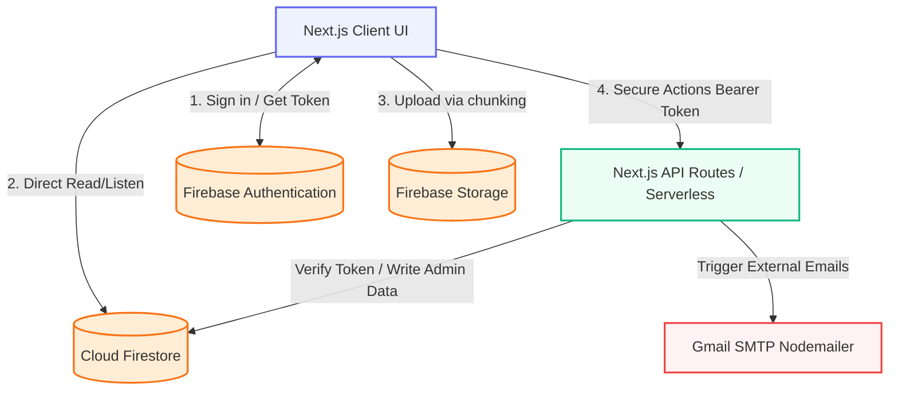
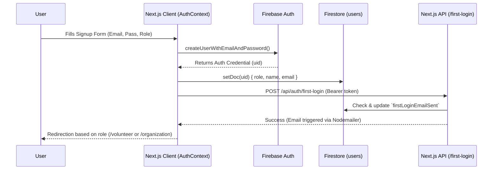
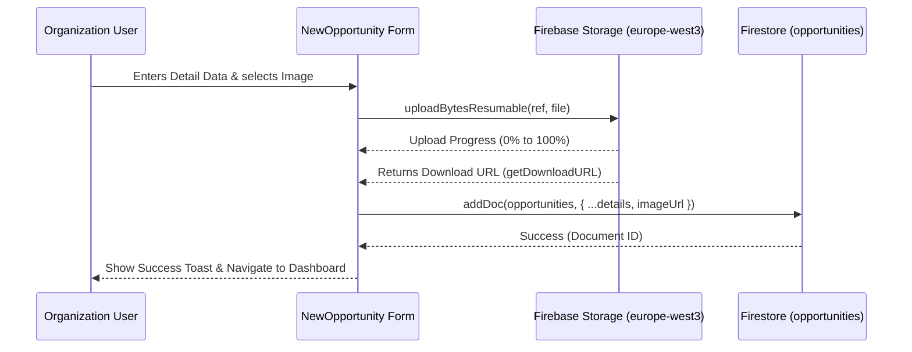
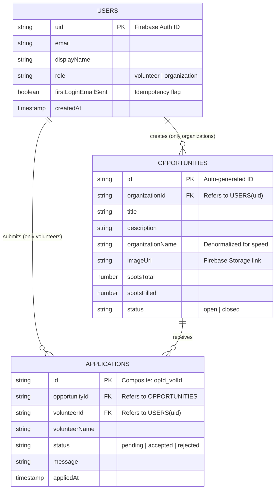

# Mutatawi System Architecture & Codebase Design 🏗️

This document provides a comprehensive and deep architectural overview of the "Mutatawi" project. It serves as the primary master reference for Software Architects and Developers to understand the data flow, directory structure, and engineering diagrams of the system.

---

## 1. Project Overview & Evolution 🚀

### Purpose
The "Mutatawi" (Volunteer) platform is an integrated web application aimed at connecting passionate volunteers with organizations providing volunteer opportunities. The platform is designed for a premium, seamless user experience, allowing users to register, browse opportunities, apply with a single click, and efficiently manage applications via dedicated dashboards.

### Tech Stack
*   **Framework**: Next.js 14 (using the modern App Router).
*   **Language**: TypeScript (ensuring Type-Safety and minimizing runtime errors).
*   **Backend & DB (Firebase)**: 
    *   **Firebase Authentication**: For identity management (Sign in/Sign up).
    *   **Cloud Firestore**: A NoSQL document database for storing entities (Users, Opportunities, Applications).
    *   **Firebase Storage**: For storing images and media (Region: `europe-west3`).
*   **Styling & UI**: Tailwind CSS (for responsive interfaces) and Framer Motion (for interactive animations).

### System Evolution
The system evolved from a traditional frontend architecture to an advanced, integrated serverless backend structure:
1.  **State Management (AuthContext)**: The system relies on `AuthContext` to monitor the user's state on the Client-Side. User data (such as their `role`) is fetched from Firestore immediately upon successful authentication and stored locally in the Context to prevent redundant re-fetching and secure the routing guard (`AuthGuard`).
2.  **Client-to-Serverless Flow**: Client requests (like applying for an opportunity) are sent alongside a Firebase ID Token (Bearer Token) to Next.js API Routes (Serverless Functions).
3.  **Backend Trust**: These routes (`/api`) verify the Token via the `firebase-admin` SDK, interact with Firestore with full administrative privileges (to ensure data integrity and idempotency), and then return the result to the client while triggering side effects like sending emails.

---

## 2. System Diagrams (Mermaid.js) 📊

### A. High-Level Architecture
This diagram describes how the Next.js Client communicates with Firebase services and the Next.js API.

### B. Authentication Flow
(Account Creation -> State Verification -> Dashboard Routing).

### C. Opportunity Submission Flow
(Organization inputs data and attaches image -> stored in `europe-west3` -> document saved).

### D. Database Schema (ER Diagram)
Representation of Firestore collections and their relationships.

---

## 3. Directory Structure & Component Analysis 📁

The project follows a strictly organized and precise Next.js App Router structure:

### `app/` (Core Application Routes)
*   **`(auth)/`**: Contains login and registration routes. We grouped the interfaces to be centralized and protected from already-logged-in users.
*   **`(dashboard)/`**: Protected dashboards sitting behind the `AuthGuard` system.
    *   `/organization`: Screens specific to organizations for adding/removing opportunities and managing applicants.
    *   `/volunteer`: The volunteer dashboard to view their applied opportunities and requests.
*   **`api/`**: Secure backend API endpoints (Serverless Routes).

### `app/components/` (Interactive UI Components)
*   **`ui/`**: Base atomic components like `Button`, `Input`, and `Badge`. Strongly reliant on `Tailwind CSS`.
*   **`shared/`**: Ubiquitous components used everywhere:
    *   `AuthGuard.tsx`: The routing guard tied to `AuthContext` to prevent unauthorized access.
    *   `ToastProvider.tsx`: Provides quick feedback popups (Toast notifications).
*   **`opportunities/`**: Specialized components like `OpportunityCard.tsx`; smart cards displaying the opportunity with context-aware buttons (apply, delete) rendered conditionally based on passed Props (e.g., `isOwner`, `showApply`).

### `app/lib/` (Core Business Logic & Shared Utilities)
*   **`firebase.ts`**: Client-side Firebase SDK configuration (exports `auth`, `db`, `storage`).
*   **`firebase-admin.ts`**: Secure server-side Admin SDK initialization. Uses `ServiceAccountKey` to read/write data bypassing standard security rules.
*   **`auth.ts`**: Custom login and account creation functions, managing both the Firebase Auth user creation and the linked Firestore profile generation.

### `app/context/` (Global Application State)
*   **`AuthContext.tsx`**: (Props: `children`, State: `user`, `profile`, `loading`).
    *   Observes authentication state via `onAuthStateChanged`.
    *   Extracts detailed user profile data (`UserProfile`) to provide `role` and other information application-wide, guaranteeing correct rendering without repeated external requests.

### Security Rules & Protection 🛡️
1.  **Route Protection**: Dashboards are wrapped by an `<AuthGuard allowedRoles={['...']} />` component, automatically redirecting users lacking appropriate privileges to the homepage or login screen.
2.  **Firestore Rules**: 
    *   Read access is generally public for Opportunities.
    *   Writes and Application modifications occur entirely through `Next.js API Routes` using the Admin SDK. Consequently, the frontend client is not blindly trusted with direct writes to sensitive documents.
3.  **Storage**: Permits `read` for everyone, but restricts `write` to authenticated users with filtering ensuring the uploaded file is strictly an image (`image/.*`).
