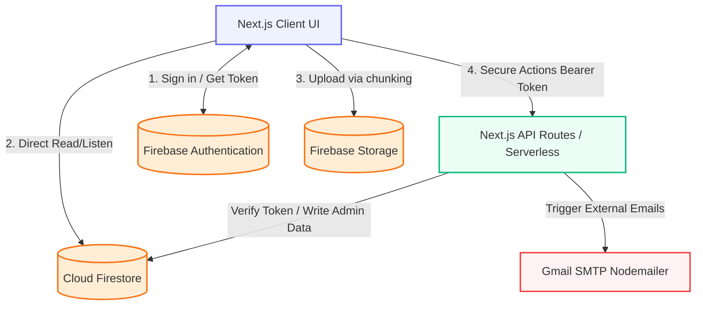
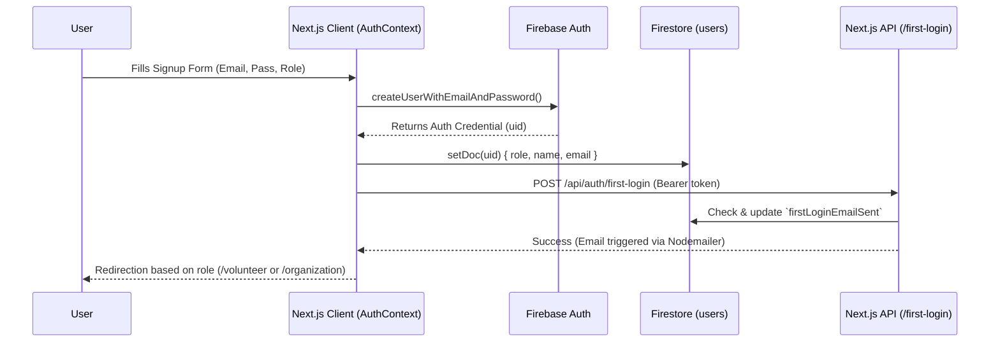
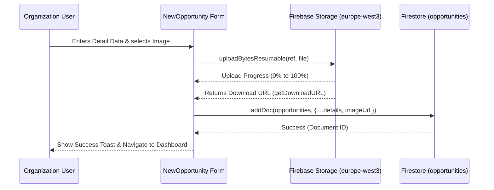
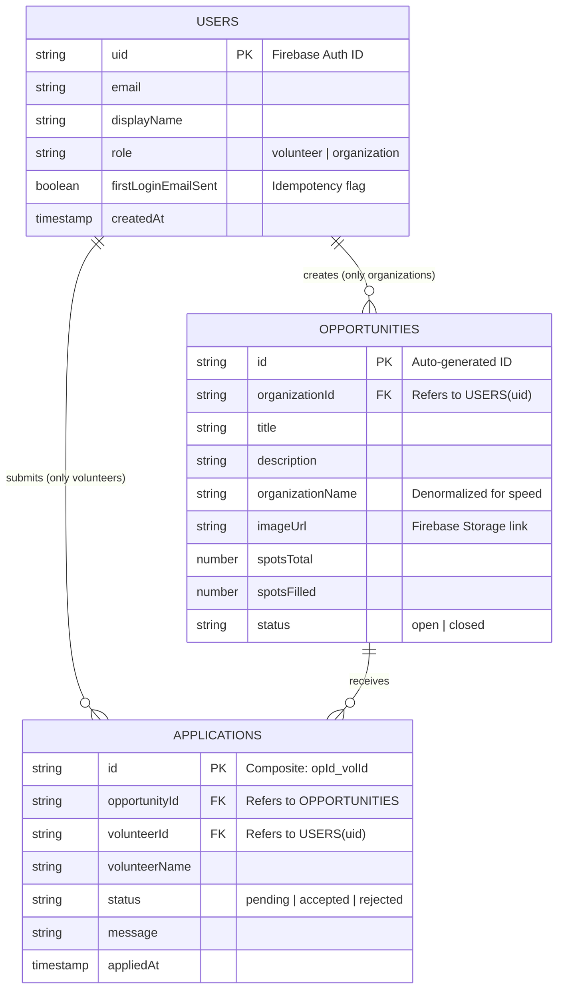

# التوثيق المعماري وهيكلية نظام "متطوع" (Mutatawi System Architecture) 🏗️

هذا المستند يقدم نظرة معمارية شاملة وعميقة لمشروع "متطوع" (Mutatawi)، ويُعد المرجع الأساسي الشامل لمهندسي البرمجيات (Software Architects) والمطورين لفهم تدفق البيانات، وهيكلة الملفات، والمخططات الهندسية الخاصة بالنظام.

---

## 1. نظرة عامة على المشروع وتطوره (Project Overview & Evolution) 🚀

### الغرض من المشروع (Purpose)
منصة "متطوع" هي تطبيق ويب متكامل يهدف إلى ربط المتطوعين شغوفي الخدمة المجتمعية بالمنظمات والمؤسسات التي تقدم فرصاً تطوعية. المنصة مصممة لتجربة مستخدم فاخرة وسلسة، تتيح التسجيل، استعراض الفرص، التقديم بضغطة زر، وإدارة الطلبات بفعالية عالية عبر لوحات تحكم مخصصة.

### التقنيات المستخدمة (Tech Stack)
*   **إطار العمل (Framework)**: Next.js 14 (باستخدام نظام التوجيه الحديث App Router).
*   **لغة البرمجة (Language)**: TypeScript (لضمان أمان الأنواع Type-Safety وتقليل الأخطاء).
*   **الخلفية وقاعدة البيانات (Backend & DB - Firebase)**: 
    *   **Firebase Authentication**: لإدارة المصادقة (دخول/تسجيل).
    *   **Cloud Firestore**: قاعدة بيانات NoSQL لتخزين الوثائق (المستخدمين، الفرص، الطلبات).
    *   **Firebase Storage**: لتخزين الصور والوسائط (منطقة `europe-west3`).
*   **التصميم والواجهات (Styling & UI)**: Tailwind CSS (لبناء واجهات متجاوبة)، و Framer Motion (للحركات التفاعلية).

### تطور النظام (System Evolution)
تطور النظام من هيكلية تقليدية للواجهة الأمامية إلى بنية خوادم وسيطة متقدمة ومتكاملة:
1.  **إدارة الحالة (State Management - AuthContext)**: يعتمد النظام على `AuthContext` لمراقبة حالة المستخدم في الواجهة الأمامية (Client-Side). يتم جلب بيانات المستخدم (مثل الـ `role`) من Firestore فور نجاح المصادقة وتخزينها محلياً في الـ Context لمنع الاستدعاءات المتكررة (Re-fetching) وتأمين حارس التوجيه (AuthGuard).
2.  **التدفق بين العميل والخادم (Client-to-Serverless Flow)**: يتم إرسال طلبات الـ Client (مثل التقديم على فرصة) مصحوبة بـ Firebase ID Token (Bearer Token) إلى Next.js API Routes (Serverless Functions).
3.  **أمان الخوادم (Backend Trust)**: تقوم هذه المسارات (`/api`) بالتحقق من الـ Token عبر مكتبة `firebase-admin`، التفاعل مع Firestore بصلاحيات مسؤول كاملة (لضمان صحة البيانات ومنع التكرار - Idempotency)، ثم إرجاع النتيجة للعميل وإطلاق إجراءات مصاحبة كإرسال الإيميلات.

---

## 2. المخططات البنيوية للنظام (System Diagrams باستخدام Mermaid.js) 📊

### أ. الهيكلية المعمارية الرفيعة (High-Level Architecture)
يصف هذا المخطط كيفية تواصل (Next.js Client) مع خدمات (Firebase) و (Next.js API).

### ب. تدفق المصادقة (Authentication Flow)
(إنشاء حساب -> توثيق الحالة -> التوجيه للوحة التحكم).

### ج. تدفق رفع الفرصة التطوعية (Opportunity Submission Flow)
(المؤسسة تُدخل البيانات وتُرفق صورة -> تخزن في `europe-west3` -> تحفظ الوثيقة).

### د. الهيكلية الكيانية وقاعدة البيانات (Database Schema - ER Diagram)
تمثيل مجموعات Firestore وعلاقاتها.

---

## 3. هيكلة المجلدات وتحليل المكونات (Directory Structure & Component Analysis) 📁

يتبع المشروع هيكلية Next.js App Router المنظمة والدقيقة:

### `app/` (مسارات التطبيق الأساسية - Routing)
*   **`(auth)/`**: يحتوي مسارات تسجيل الدخول والتسجيل. دمجنا فيها الواجهات لتكون مركزية ومحمية من دخول المستخدم الذي سجل بالفعل.
*   **`(dashboard)/`**: لوحات التحكم المحمية خلف نظام `AuthGuard`.
    *   `/organization`: الشاشات الخاصة بالمنظمات لإضافة وحذف الفرص وإدارة المتقدمين.
    *   `/volunteer`: لوحة المتطوع لرؤية فرصه وطلباته المُقدمة.
*   **`api/`**: خوادم نهاية الواجهة الخلفية الآمنة (API Routes).

### `app/components/` (المكونات التفاعلية للواجهة - UI Components)
*   **`ui/`**: الأزرار الأساسية (`Button`)، وحقول الإدخال (`Input`)، والشارات (`Badge`). تعتمد على `Tailwind CSS`.
*   **`shared/`**: مكونات تُستخدم في كل مكان:
    *   `AuthGuard.tsx`: حارس التوجيه المرتبط بالـ `AuthContext` لمنع الوصول لغير المصرح لهم.
    *   `ToastProvider.tsx`: لتوفير ردود الفعل السريعة (Toast popups).
*   **`opportunities/`**: مكونات مثل `OpportunityCard.tsx`؛ بطاقات ذكية لعرض الفرصة مع أزرار تقديم أو حذف بناءً على الـ Props المُمررة (مثل `isOwner` و `showApply`).

### `app/lib/` (المنطق البرمجي والأدوات المشتركة - Core Utils)
*   **`firebase.ts`**: ملف تهيئة واجهة العميل للاتصال بـ Firebase (تصدير `auth`, `db`, `storage`).
*   **`firebase-admin.ts`**: ملف تهيئة خادم المسؤول الآمن (Admin SDK). يستخدم `ServiceAccountKey` لقراءة وكتابة البيانات بتخطي قواعد الأمان.
*   **`auth.ts`**: دوال تسجيل الدخول وإنشاء الحسابات المخصصة، التي تتولى إنشاء حساب في Firebase Auth وبناء 문서 الـ profile المرتبط به في Firestore.

### `app/context/` (إدارة حالة التطبيق - Global State Context)
*   **`AuthContext.tsx`**: (Props: `children`, State: `user`, `profile`, `loading`).
    *   يراقب حالة المصادقة عبر `onAuthStateChanged`.
    *   يستخرج تفاصيل حساب المستخدم (`UserProfile`) لتوفير `role` ومعلومات أخرى للتطبيق بالكامل لضمان ريندرينج (Rendering) صحيح دون طلبات خارجية.

### سياسات الأمان والتصاريح (Security Rules & Protection) 🛡️
1.  **حماية المسارات (Route Protection)**: يتم تغليف اللوحات بمكون `<AuthGuard allowedRoles={['...']} />`، والذي يقوم بإعادة توجيه من لا يمتلك الـ Role المناسب إلى الشاشة الرئيسية أو صفحة تسجيل الدخول.
2.  **قواعد Firestore (Firestore Rules)**: 
    *   القراءة متاحة للعموم للفرص (Opportunities).
    *   أما الكتابة وتعديل الطلبات (Applications) فهي تتم كلياً عبر `Next.js API Routes` باستخدام الـ Admin SDK. وبذلك، لا نعطي الواجهة الأمامية ثقة بالكتابة المباشرة في مستندات حساسة.
3.  **تخزين Storage**: يسمح بـ `read` للجميع، و `write` فقط للمستخدمين الموثوقين مع فلترة بأن الملف المحمّل عبارة عن صورة (`image/.*`).
