# 🔄 Mutatawi Platform — Systems Flow Documentation

> This document outlines the data flow and operations for all systems in the Mutatawi volunteering platform.

---

## 📋 Systems Index

| # | System | Description |
|---|--------|-------------|
| 1 | [Authentication](#1--authentication-system) | Sign up, sign in, Google OAuth, password reset |
| 2 | [Opportunities](#2--opportunities-system) | Create, list, edit, delete, auto-expiration |
| 3 | [Applications](#3--applications-system) | Apply, withdraw, accept, reject |
| 4 | [Email Notifications](#4--email-notifications) | 6 email types via Gmail SMTP |
| 5 | [Dashboards](#5--dashboards) | Organization + Volunteer dashboards |
| 6 | [Data Layer](#6--data-layer) | Firebase Firestore + Custom Hooks |
| 7 | [Infrastructure](#7--infrastructure) | Firebase Client/Admin SDK + Vercel |

---

## 1. 🔐 Authentication System

### General Flow

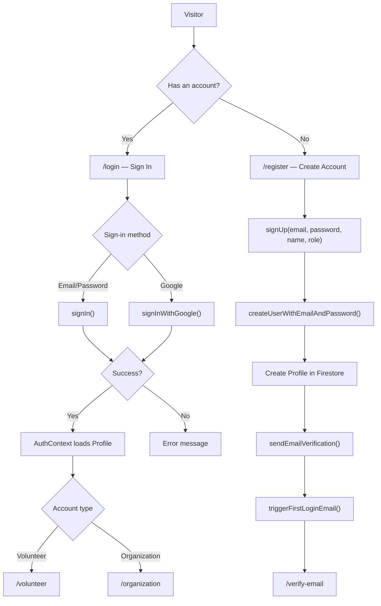

### Password Reset Flow

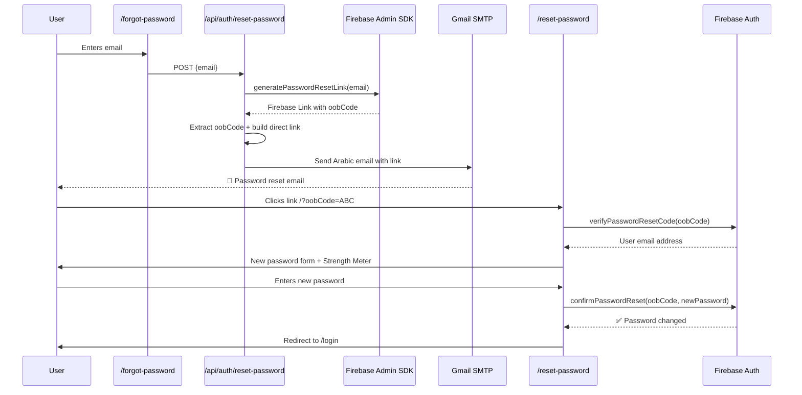

### System Files

| File | Purpose |
|------|---------|
| `app/lib/firebase.ts` | Firebase Client SDK initialization |
| `app/lib/auth.ts` | signUp, signIn, signOut, resetPassword, etc. |
| `app/context/AuthContext.tsx` | AuthProvider + onAuthStateChanged listener |
| `app/(auth)/login/page.tsx` | Login page |
| `app/(auth)/register/page.tsx` | Registration page |
| `app/(auth)/forgot-password/page.tsx` | Forgot password page |
| `app/(auth)/reset-password/page.tsx` | Set new password page |
| `app/(auth)/verify-email/page.tsx` | Email verification page |
| `app/(auth)/complete-profile/page.tsx` | Profile completion page |
| `app/api/auth/reset-password/route.ts` | API — send reset email via SMTP |
| `app/api/auth/first-login/route.ts` | API — send welcome email |

---

## 2. 📢 Opportunities System

### Opportunity Lifecycle

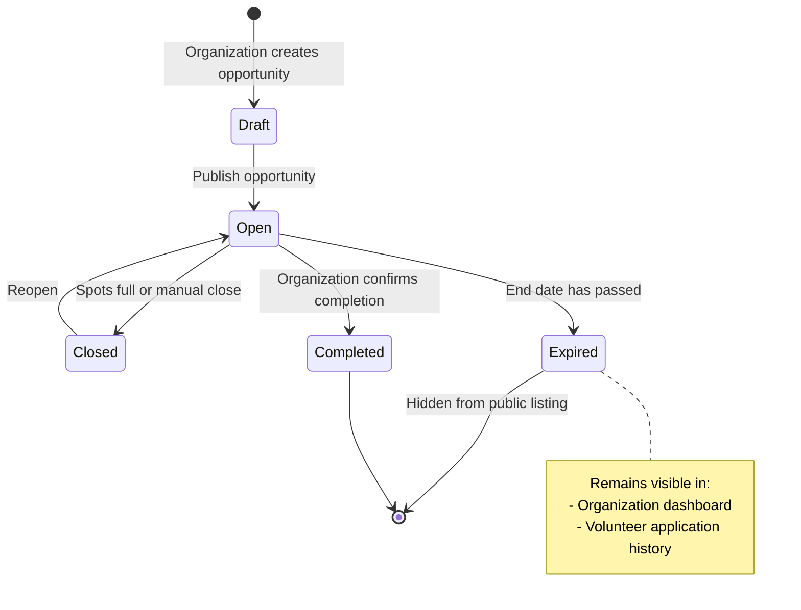

### Create Opportunity Flow

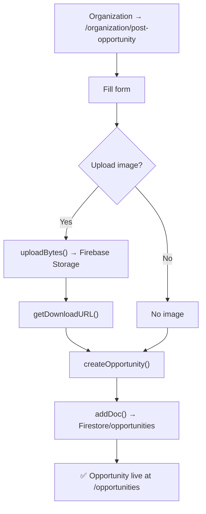

### Browse & Filter Opportunities

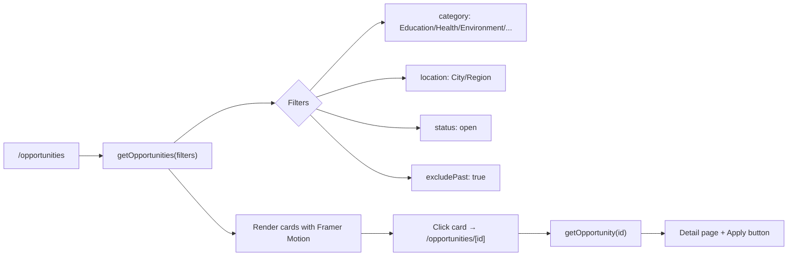

### System Files

| File | Purpose |
|------|---------|
| `app/lib/firestore.ts` | createOpportunity, getOpportunities, updateOpportunity, deleteOpportunity |
| `app/opportunities/page.tsx` | All opportunities listing with filters |
| `app/opportunities/[id]/page.tsx` | Single opportunity details |
| `app/(dashboard)/organization/post-opportunity/page.tsx` | Post new opportunity |
| `app/(dashboard)/organization/edit-opportunity/page.tsx` | Edit opportunity |

---

## 3. 📝 Applications System

### Application Flow

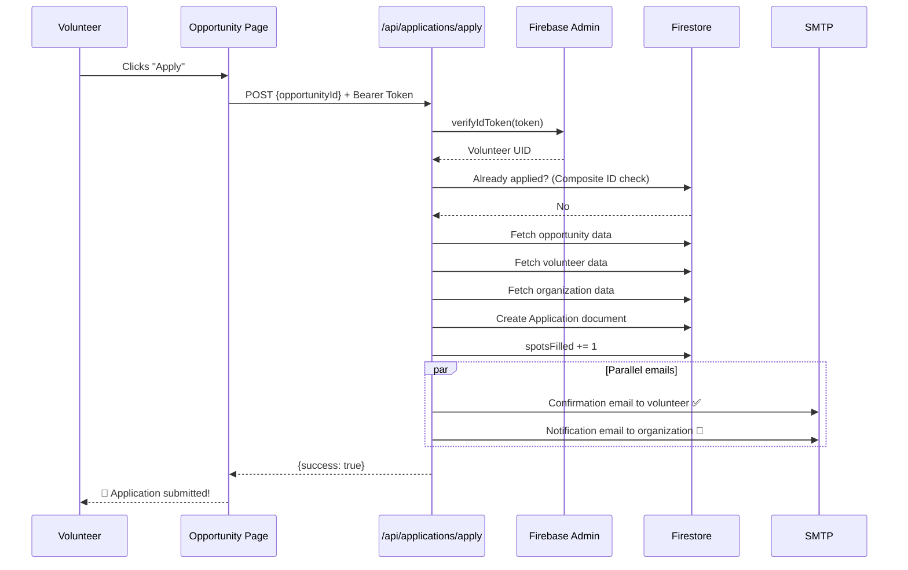

### Application States

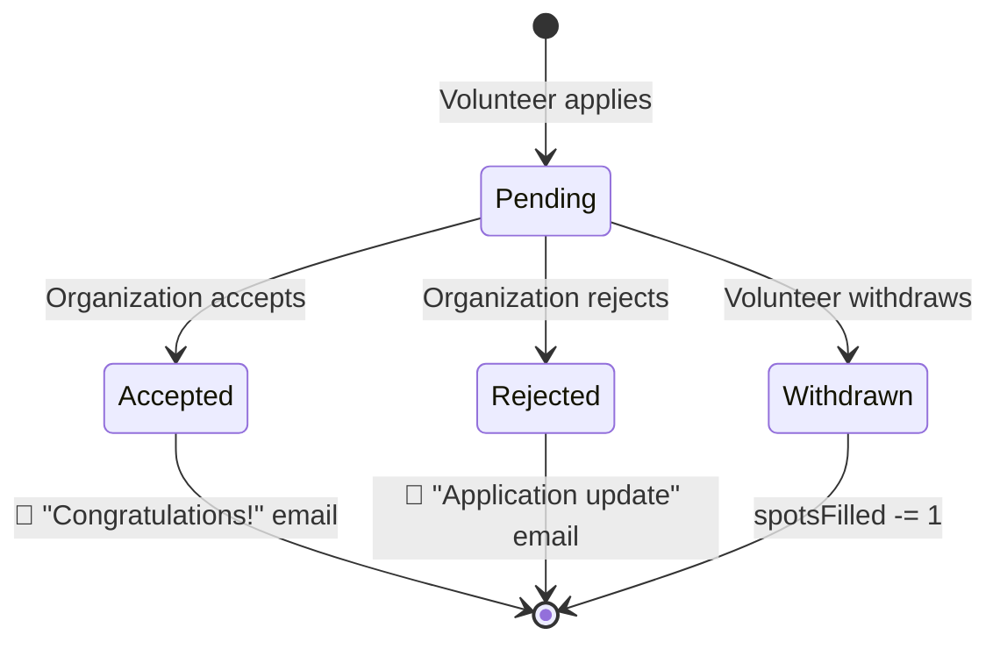

### System Files

| File | Purpose |
|------|---------|
| `app/api/applications/apply/route.ts` | Apply API (token-protected) |
| `app/api/applications/withdraw/route.ts` | Withdraw API |
| `app/lib/firestore.ts` | createApplication, updateApplicationStatus, withdrawApplication |
| `app/(dashboard)/organization/applicants/page.tsx` | Manage applicants |

---

## 4. 📧 Email Notifications

### Email Types

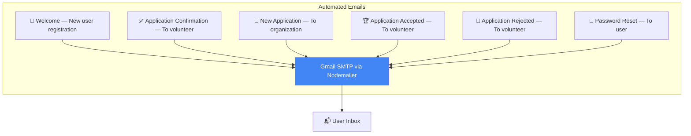

### Email Template Structure

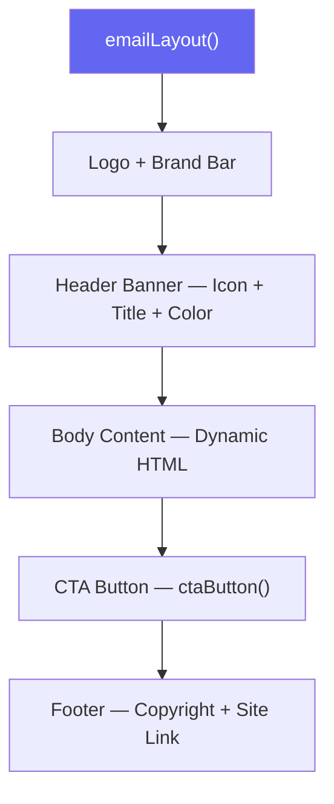

### System Files

| File | Purpose |
|------|---------|
| `app/lib/email.ts` | Template engine + 5 email functions |
| `app/api/auth/reset-password/route.ts` | Password reset email |
| `app/api/auth/first-login/route.ts` | Welcome email |
| `.env.local` | SMTP_EMAIL + SMTP_PASSWORD |

---

## 5. 📊 Dashboards

### Organization Dashboard

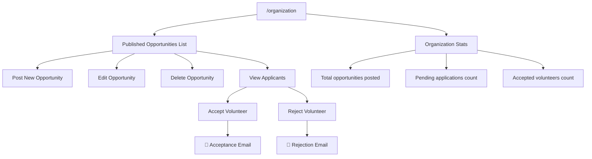

### Volunteer Dashboard

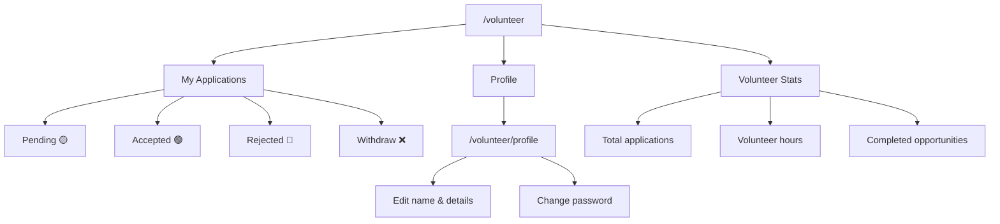

### System Files

| File | Purpose |
|------|---------|
| `app/(dashboard)/layout.tsx` | Shared dashboard layout |
| `app/(dashboard)/organization/page.tsx` | Organization main dashboard |
| `app/(dashboard)/organization/applicants/page.tsx` | Manage applicants |
| `app/(dashboard)/organization/post-opportunity/page.tsx` | Post opportunity |
| `app/(dashboard)/organization/edit-opportunity/page.tsx` | Edit opportunity |
| `app/(dashboard)/volunteer/page.tsx` | Volunteer main dashboard |
| `app/(dashboard)/volunteer/profile/page.tsx` | Profile page |

---

## 6. 💾 Data Layer

### Data Model (Entity Relationship Diagram)

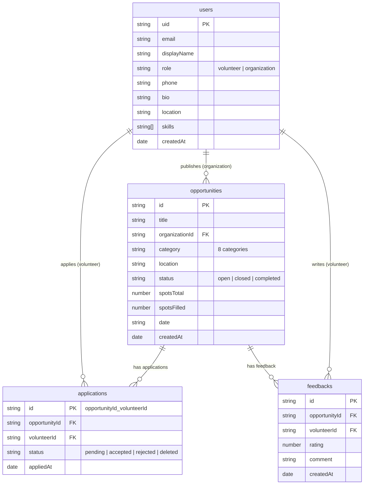

### Hooks & Data Access Patterns

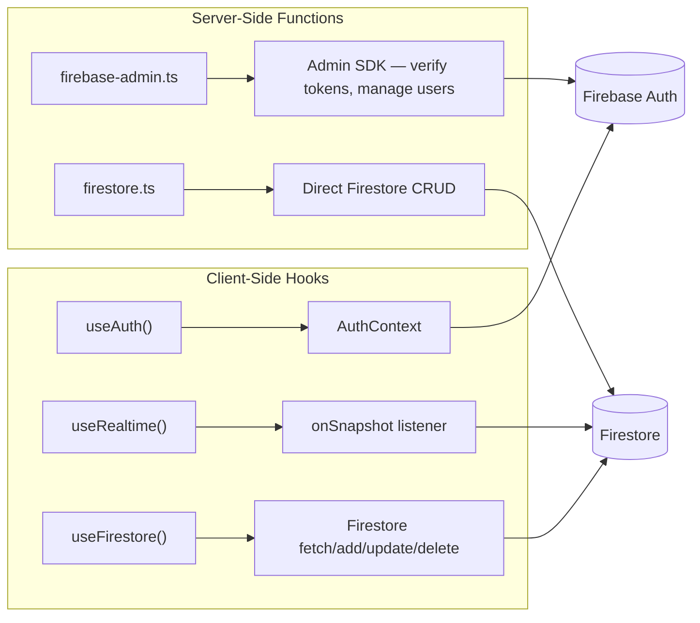

---

## 7. 🏗️ Infrastructure

### Deployment Architecture

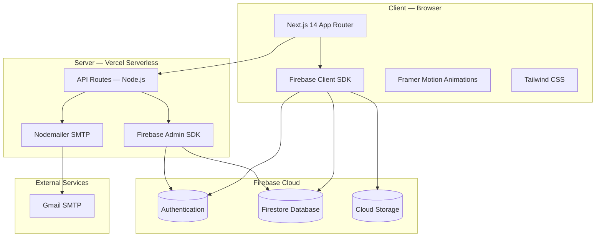

### Tech Stack

| Layer | Technology |
|-------|-----------|
| Framework | Next.js 14 (App Router) |
| Language | TypeScript |
| Styling | Tailwind CSS |
| Animations | Framer Motion |
| Auth | Firebase Authentication |
| Database | Cloud Firestore |
| Storage | Firebase Cloud Storage |
| Email | Nodemailer + Gmail SMTP |
| Icons | React Icons (Ionicons) |
| Toasts | React Hot Toast |
| Hosting | Vercel |
| Admin SDK | firebase-admin |

### Directory Structure

```
app/
├── (auth)/                   # 🔐 Authentication Pages
│   ├── login/
│   ├── register/
│   ├── forgot-password/
│   ├── reset-password/
│   ├── verify-email/
│   └── complete-profile/
├── (dashboard)/              # 📊 Dashboards
│   ├── organization/
│   │   ├── page.tsx          # Main dashboard
│   │   ├── applicants/       # Manage applicants
│   │   ├── post-opportunity/ # Post opportunity
│   │   └── edit-opportunity/ # Edit opportunity
│   └── volunteer/
│       ├── page.tsx          # Main dashboard
│       └── profile/          # User profile
├── api/                      # 🔌 API Routes
│   ├── applications/
│   │   ├── apply/            # POST — Submit application
│   │   └── withdraw/         # POST — Withdraw application
│   ├── auth/
│   │   ├── first-login/      # POST — Welcome email
│   │   └── reset-password/   # POST — Password reset email
│   └── send-email/           # POST — General email
├── opportunities/            # 📢 Volunteer Opportunities
│   ├── page.tsx              # Opportunities listing
│   └── [id]/page.tsx         # Opportunity details
├── components/               # 🧱 Reusable Components
│   ├── auth/                 # LoginForm, RegisterForm
│   ├── dashboard/            # Sidebar, StatsCard, etc.
│   ├── landing/              # Hero, Features, etc.
│   ├── layout/               # Navbar, Footer
│   ├── shared/               # LoadingSpinner, etc.
│   └── ui/                   # Button, Input, etc.
├── context/AuthContext.tsx    # 🔑 Auth State Management
├── hooks/                    # 🪝 Custom React Hooks
│   ├── useAuth.ts
│   ├── useFirestore.ts
│   └── useRealtime.ts
├── lib/                      # 📚 Shared Libraries
│   ├── firebase.ts           # Client SDK init
│   ├── firebase-admin.ts     # Admin SDK init
│   ├── auth.ts               # Auth functions
│   ├── firestore.ts          # Firestore CRUD
│   ├── email.ts              # Email templates + send
│   └── utils.ts              # Helper utilities
└── types/index.ts            # 📝 TypeScript Interfaces
```

---

> 📅 Last updated: February 23, 2026
