# 🔄 مخططات أنظمة منصة متطوع (Mutatawi Systems Flow)

> هذا المستند يوضح تدفق البيانات والعمليات لجميع الأنظمة في المنصة.

---

## 📋 فهرس الأنظمة

| # | النظام | الوصف |
|---|--------|-------|
| 1 | [المصادقة](#1--نظام-المصادقة-authentication) | تسجيل، دخول، Google OAuth، استعادة كلمة المرور |
| 2 | [الفرص التطوعية](#2--نظام-الفرص-التطوعية-opportunities) | إنشاء، عرض، تعديل، حذف، انتهاء تلقائي |
| 3 | [طلبات التقديم](#3--نظام-طلبات-التقديم-applications) | تقديم، سحب، قبول، رفض |
| 4 | [الإيميلات](#4--نظام-الإيميلات-email-notifications) | 6 أنواع إيميلات عبر Gmail SMTP |
| 5 | [لوحات التحكم](#5--لوحات-التحكم-dashboards) | لوحة المنظمة + لوحة المتطوع |
| 6 | [طبقة البيانات](#6--طبقة-البيانات-data-layer) | Firebase Firestore + Hooks |
| 7 | [البنية التحتية](#7--البنية-التحتية-infrastructure) | Firebase Client/Admin SDK + Vercel |

---

## 1. 🔐 نظام المصادقة (Authentication)

### التدفق العام

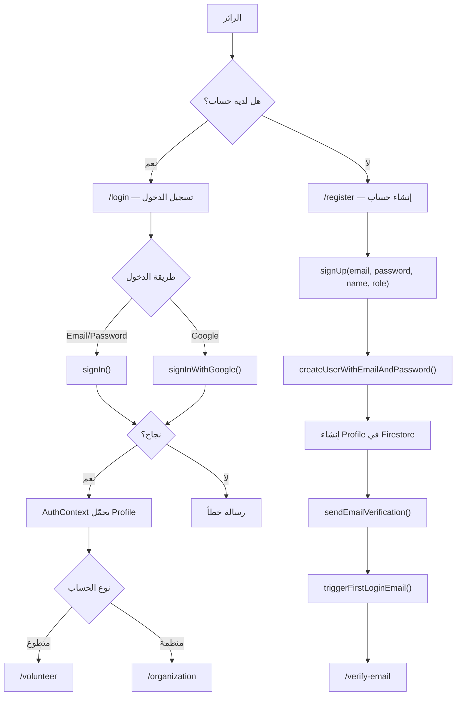

### تدفق نسيت كلمة المرور

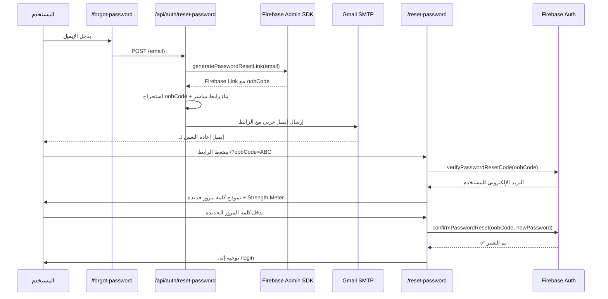

### ملفات النظام

| الملف | الوظيفة |
|-------|---------|
| `app/lib/firebase.ts` | تهيئة Firebase Client SDK |
| `app/lib/auth.ts` | دوال signUp, signIn, signOut, resetPassword, etc. |
| `app/context/AuthContext.tsx` | AuthProvider + onAuthStateChanged listener |
| `app/(auth)/login/page.tsx` | صفحة تسجيل الدخول |
| `app/(auth)/register/page.tsx` | صفحة إنشاء حساب |
| `app/(auth)/forgot-password/page.tsx` | صفحة نسيت كلمة المرور |
| `app/(auth)/reset-password/page.tsx` | صفحة تعيين كلمة مرور جديدة |
| `app/(auth)/verify-email/page.tsx` | صفحة تأكيد البريد |
| `app/(auth)/complete-profile/page.tsx` | إكمال الملف الشخصي |
| `app/api/auth/reset-password/route.ts` | API لإرسال إيميل إعادة التعيين عبر SMTP |
| `app/api/auth/first-login/route.ts` | API لإرسال إيميل ترحيبي |

---

## 2. 📢 نظام الفرص التطوعية (Opportunities)

### دورة حياة الفرصة

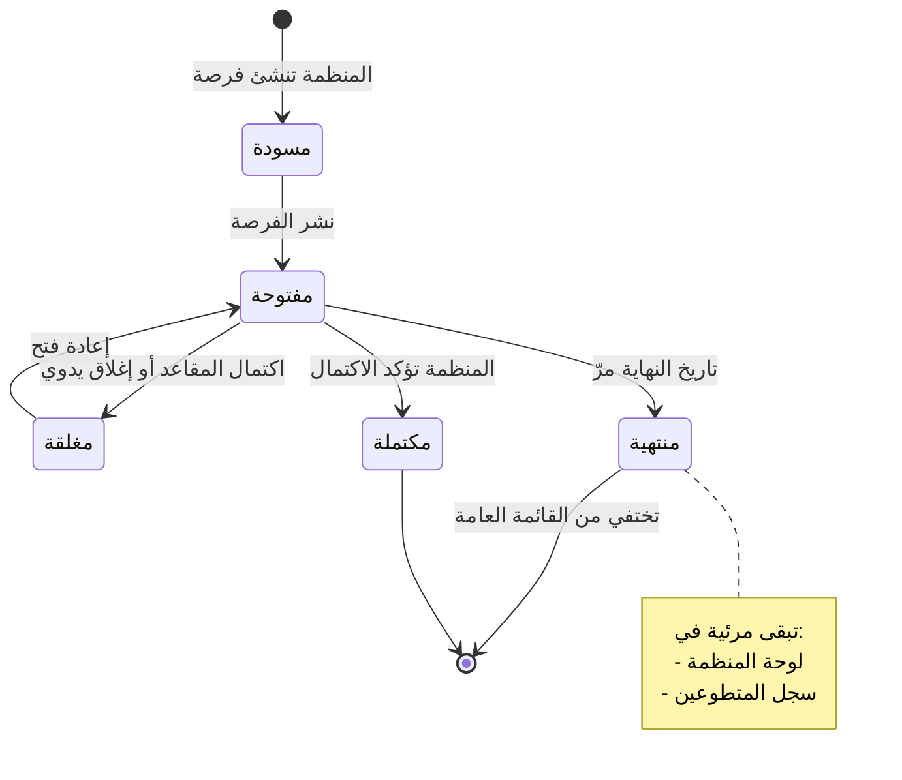

### تدفق إنشاء فرصة

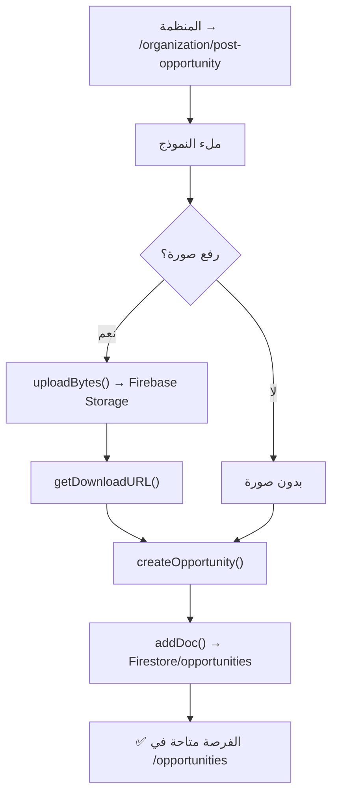

### عرض وفلترة الفرص

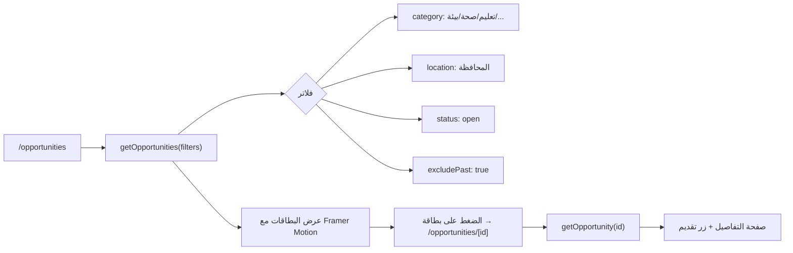

### ملفات النظام

| الملف | الوظيفة |
|-------|---------|
| `app/lib/firestore.ts` | createOpportunity, getOpportunities, updateOpportunity, deleteOpportunity |
| `app/opportunities/page.tsx` | صفحة عرض جميع الفرص مع فلاتر |
| `app/opportunities/[id]/page.tsx` | صفحة تفاصيل فرصة واحدة |
| `app/(dashboard)/organization/post-opportunity/page.tsx` | نشر فرصة جديدة |
| `app/(dashboard)/organization/edit-opportunity/page.tsx` | تعديل فرصة |

---

## 3. 📝 نظام طلبات التقديم (Applications)

### تدفق التقديم

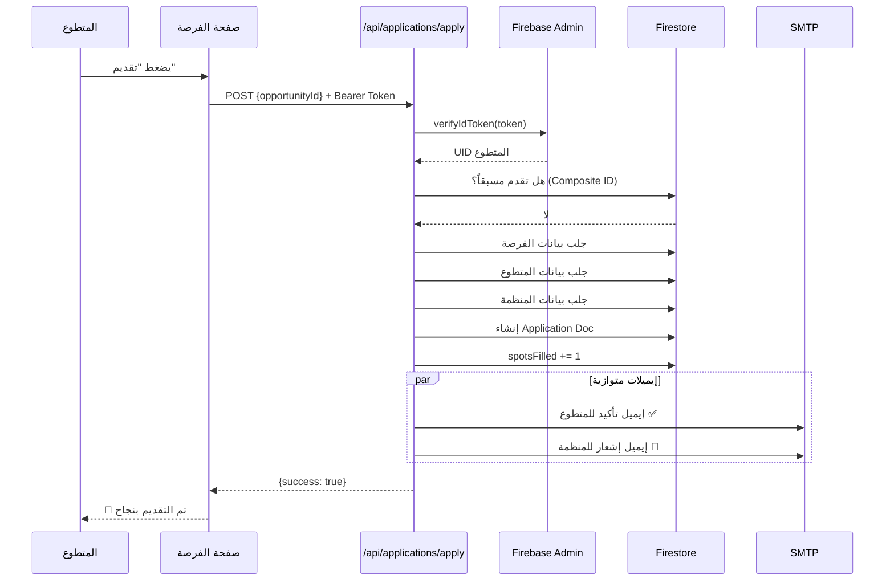

### حالات الطلب

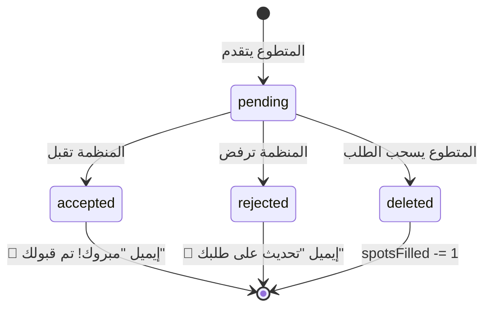

### ملفات النظام

| الملف | الوظيفة |
|-------|---------|
| `app/api/applications/apply/route.ts` | API تقديم طلب (مع حماية Token) |
| `app/api/applications/withdraw/route.ts` | API سحب طلب |
| `app/lib/firestore.ts` | createApplication, updateApplicationStatus, withdrawApplication |
| `app/(dashboard)/organization/applicants/page.tsx` | عرض وإدارة المتقدمين |

---

## 4. 📧 نظام الإيميلات (Email Notifications)

### أنواع الإيميلات

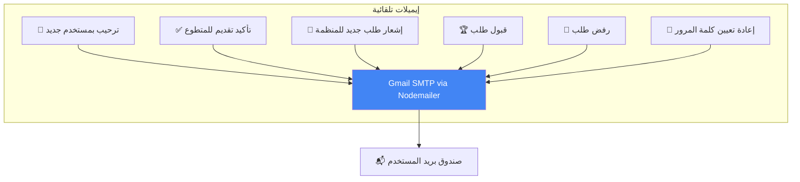

### قالب الإيميل

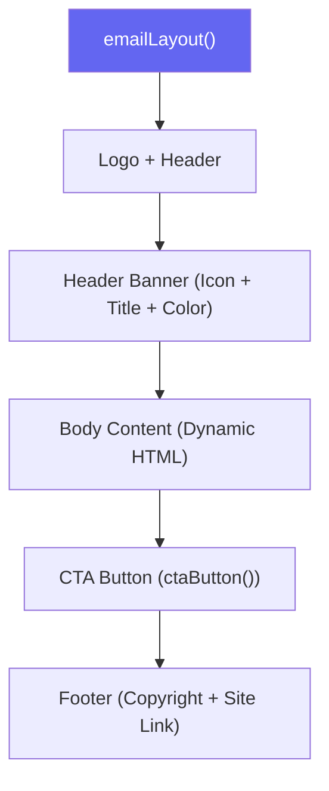

### ملفات النظام

| الملف | الوظيفة |
|-------|---------|
| `app/lib/email.ts` | Template engine + 5 email functions |
| `app/api/auth/reset-password/route.ts` | إيميل إعادة تعيين كلمة المرور |
| `app/api/auth/first-login/route.ts` | إيميل ترحيبي |
| `.env.local` | SMTP_EMAIL + SMTP_PASSWORD |

---

## 5. 📊 لوحات التحكم (Dashboards)

### لوحة المنظمة

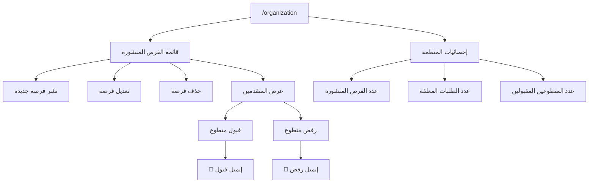

### لوحة المتطوع

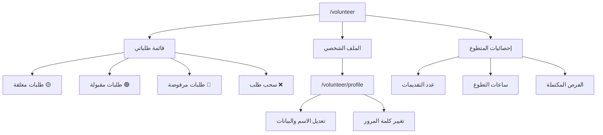

### ملفات النظام

| الملف | الوظيفة |
|-------|---------|
| `app/(dashboard)/layout.tsx` | Layout مشترك للوحات التحكم |
| `app/(dashboard)/organization/page.tsx` | لوحة المنظمة الرئيسية |
| `app/(dashboard)/organization/applicants/page.tsx` | إدارة المتقدمين |
| `app/(dashboard)/organization/post-opportunity/page.tsx` | نشر فرصة |
| `app/(dashboard)/organization/edit-opportunity/page.tsx` | تعديل فرصة |
| `app/(dashboard)/volunteer/page.tsx` | لوحة المتطوع الرئيسية |
| `app/(dashboard)/volunteer/profile/page.tsx` | الملف الشخصي |

---

## 6. 💾 طبقة البيانات (Data Layer)

### نموذج البيانات (Data Model)

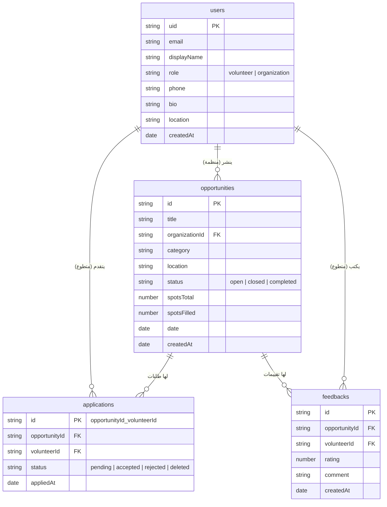

### Hooks وأنماط الوصول

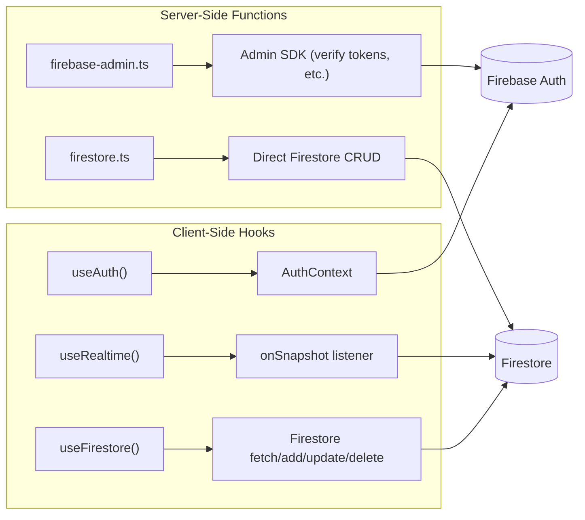

---

## 7. 🏗️ البنية التحتية (Infrastructure)

### بنية النشر

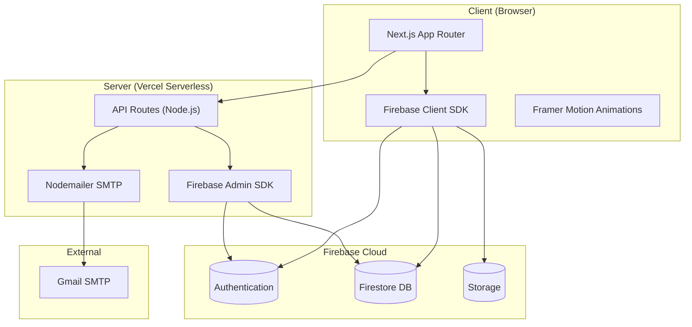

### شجرة الملفات

```
app/
├── (auth)/                   # 🔐 صفحات المصادقة
│   ├── login/
│   ├── register/
│   ├── forgot-password/
│   ├── reset-password/
│   ├── verify-email/
│   └── complete-profile/
├── (dashboard)/              # 📊 لوحات التحكم
│   ├── organization/
│   │   ├── page.tsx          # الرئيسية
│   │   ├── applicants/       # إدارة المتقدمين
│   │   ├── post-opportunity/ # نشر فرصة
│   │   └── edit-opportunity/ # تعديل فرصة
│   └── volunteer/
│       ├── page.tsx          # الرئيسية
│       └── profile/          # الملف الشخصي
├── api/                      # 🔌 API Routes
│   ├── applications/
│   │   ├── apply/            # POST — تقديم طلب
│   │   └── withdraw/         # POST — سحب طلب
│   ├── auth/
│   │   ├── first-login/      # POST — إيميل ترحيبي
│   │   └── reset-password/   # POST — إيميل إعادة تعيين
│   └── send-email/           # POST — إرسال إيميل عام
├── opportunities/            # 📢 الفرص التطوعية
│   ├── page.tsx              # قائمة الفرص
│   └── [id]/page.tsx         # تفاصيل فرصة
├── components/               # 🧱 المكوّنات
│   ├── auth/                 # LoginForm, RegisterForm
│   ├── dashboard/            # Sidebar, StatsCard, etc.
│   ├── landing/              # Hero, Features, etc.
│   ├── layout/               # Navbar, Footer
│   ├── shared/               # LoadingSpinner, etc.
│   └── ui/                   # Button, Input, etc.
├── context/AuthContext.tsx    # 🔑 Auth State Management
├── hooks/                    # 🪝 Custom Hooks
│   ├── useAuth.ts
│   ├── useFirestore.ts
│   └── useRealtime.ts
├── lib/                      # 📚 مكتبات مشتركة
│   ├── firebase.ts           # Client SDK init
│   ├── firebase-admin.ts     # Admin SDK init
│   ├── auth.ts               # Auth functions
│   ├── firestore.ts          # Firestore CRUD
│   ├── email.ts              # Email templates + send
│   └── utils.ts              # Helpers
└── types/index.ts            # 📝 TypeScript Interfaces
```

---

> 📅 آخر تحديث: ٢٣ فبراير ٢٠٢٦
