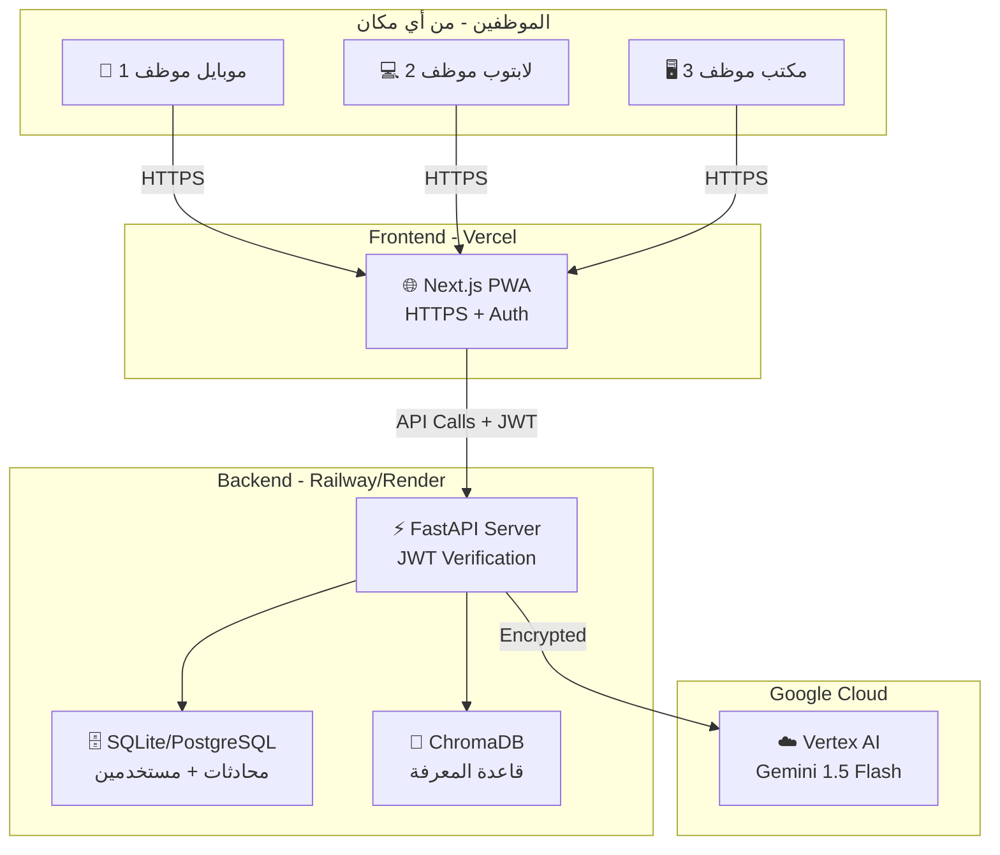
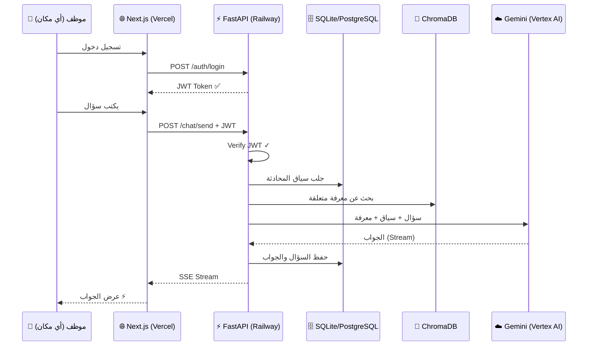

# مساعد الشركة الذكي - Company AI Assistant

نظام مساعد ذكي للشركة يعمل من أي مكان، محصور للموظفين فقط، يستخدم Gemini عبر Vertex AI.

## User Review Required

> [!IMPORTANT]
> **التغيير الجوهري من الخطة السابقة:**
> - ~~شبكة محلية (WiFi الدار)~~ → **سحابي (Cloud) متاح من أي مكان**
> - ~~للعيلة~~ → **للموظفين فقط (مع نظام تسجيل دخول)**
> - ~~SQLite على لابتوب~~ → **PostgreSQL سحابي** (أو نخليها SQLite إذا بدك توفر)
> - ~~بدون تشفير~~ → **HTTPS + JWT Authentication**

> [!IMPORTANT]
> **خيارات الاستضافة - أنت تختار:**
>
> | الخيار | Frontend | Backend | Database | التكلفة الشهرية |
> |--------|----------|---------|----------|----------------|
> | **A: مجاني تقريباً** | Vercel (Free) | Railway Free / Render Free | SQLite on server | ~$0 |
> | **B: احترافي** | Vercel (Free) | Railway ($5/mo) | PostgreSQL on Railway | ~$5-10 |
> | **C: كله Google** | Firebase Hosting | Cloud Run | Cloud SQL | ~$10-30 |
>
> **توصيتي: الخيار A** للبداية، وسهل الترقية لاحقاً.

> [!IMPORTANT]
> **نظام الدخول - خيارات:**
> 1. **Firebase Auth** (توصيتي) - Google login أو email/password، مجاني حتى 50K مستخدم
> 2. **بدون Firebase** - JWT tokens بسيط مع username/password مخزنة بالداتابيس
>
> أيهم تفضل؟

---

## Architecture Overview



---

## Project Structure

```
CompanyAI/
├── backend/                      # FastAPI Server
│   ├── main.py                   # FastAPI app + CORS
│   ├── config.py                 # Settings from env vars
│   ├── requirements.txt
│   ├── Dockerfile                # For cloud deployment
│   │
│   ├── api/
│   │   ├── auth.py               # Login, register, JWT
│   │   ├── chat.py               # Chat endpoints
│   │   ├── users.py              # Employee management
│   │   └── knowledge.py          # Document upload (admin only)
│   │
│   ├── core/
│   │   ├── database.py           # SQLite/PostgreSQL
│   │   ├── vectorstore.py        # ChromaDB
│   │   ├── ai_client.py          # Vertex AI client
│   │   ├── rag_pipeline.py       # RAG orchestrator
│   │   └── security.py           # JWT, password hashing, roles
│   │
│   └── models/
│       └── schemas.py            # Pydantic models
│
├── frontend/                     # Next.js PWA
│   ├── app/
│   │   ├── layout.tsx            # RTL Arabic layout
│   │   ├── page.tsx              # Login page
│   │   ├── chat/page.tsx         # Chat interface
│   │   └── admin/page.tsx        # Admin panel
│   │
│   ├── components/
│   │   ├── ChatMessage.tsx
│   │   ├── ChatInput.tsx
│   │   ├── LoginForm.tsx         # NEW: Employee login
│   │   └── Sidebar.tsx
│   │
│   ├── lib/
│   │   ├── api.ts                # API client + auth headers
│   │   └── auth.ts               # Auth context + token management
│   │
│   └── public/
│       └── manifest.json         # PWA config
│
├── Dockerfile                    # Backend deployment
└── docs/
    └── setup.md
```

---

## Proposed Changes

### Component 1: Authentication & Security (جديد بالكامل)

#### [NEW] [core/security.py](file:///C:/Users/abdel/Desktop/CompanyAI/backend/core/security.py)
- JWT token creation/verification (access + refresh tokens)
- Password hashing with `bcrypt`
- Role-based access: `admin` (أنت) و `employee` (الموظفين)
- Middleware: verify JWT on every request
- Admin-only decorator for sensitive endpoints

#### [NEW] [api/auth.py](file:///C:/Users/abdel/Desktop/CompanyAI/backend/api/auth.py)
Endpoints:
- `POST /api/auth/login` - تسجيل دخول → JWT token
- `POST /api/auth/register` - تسجيل موظف جديد (admin only)
- `POST /api/auth/refresh` - تجديد التوكن
- `GET /api/auth/me` - بيانات الموظف الحالي

#### [NEW] [frontend/lib/auth.ts](file:///C:/Users/abdel/Desktop/CompanyAI/frontend/lib/auth.ts)
- Auth context (React Context)
- Token storage in `localStorage`
- Auto-refresh token logic
- Protected route wrapper

#### [NEW] [frontend/components/LoginForm.tsx](file:///C:/Users/abdel/Desktop/CompanyAI/frontend/components/LoginForm.tsx)
- صفحة دخول عصرية مع شعار الشركة
- Email + Password fields
- "حفظ تسجيل الدخول" checkbox

---

### Component 2: Backend - FastAPI (محدّث)

#### [NEW] [Dockerfile](file:///C:/Users/abdel/Desktop/CompanyAI/backend/Dockerfile)
- Python 3.11 slim image
- Install dependencies
- Expose port 8000
- Run with uvicorn

#### [NEW] [core/database.py](file:///C:/Users/abdel/Desktop/CompanyAI/backend/core/database.py)
SQLite/PostgreSQL tables:
```sql
CREATE TABLE employees (
    id TEXT PRIMARY KEY,
    name TEXT NOT NULL,
    email TEXT UNIQUE NOT NULL,
    password_hash TEXT NOT NULL,
    role TEXT DEFAULT 'employee',  -- 'admin' or 'employee'
    department TEXT,
    created_at TIMESTAMP DEFAULT CURRENT_TIMESTAMP
);

CREATE TABLE conversations (
    id TEXT PRIMARY KEY,
    employee_id TEXT NOT NULL REFERENCES employees(id),
    title TEXT,
    created_at TIMESTAMP DEFAULT CURRENT_TIMESTAMP
);

CREATE TABLE messages (
    id TEXT PRIMARY KEY,
    conversation_id TEXT NOT NULL REFERENCES conversations(id),
    role TEXT NOT NULL,  -- 'user' or 'assistant'
    content TEXT NOT NULL,
    created_at TIMESTAMP DEFAULT CURRENT_TIMESTAMP
);
```

#### [NEW] Other backend files
Same as previous plan but with:
- Every endpoint requires JWT authentication
- Admin endpoints require `role='admin'`
- Employees can only see their own conversations

---

### Component 3: Frontend - Next.js PWA (محدّث)

#### [NEW] [app/page.tsx](file:///C:/Users/abdel/Desktop/CompanyAI/frontend/app/page.tsx)
- **صفحة تسجيل الدخول** بدلاً من اختيار المستخدم
- تصميم dark premium مع glassmorphism
- بعد الدخول → redirect لصفحة المحادثة

#### [NEW] [app/chat/page.tsx](file:///C:/Users/abdel/Desktop/CompanyAI/frontend/app/chat/page.tsx)
- Protected route (يحتاج login)
- اسم الموظف يظهر بالأعلى
- باقي الميزات نفسها (محادثة، streaming، sidebar)

#### [NEW] [app/admin/page.tsx](file:///C:/Users/abdel/Desktop/CompanyAI/frontend/app/admin/page.tsx)
- **Admin only** - بيظهر بس للـ admin
- إدارة الموظفين (إضافة/حذف)
- رفع وثائق المعرفة
- إحصائيات الاستخدام

---

### Component 4: Deployment

#### Frontend Deployment (Vercel)
```bash
# ربط المشروع بـ Vercel
cd frontend
npx vercel --prod
# Set env: NEXT_PUBLIC_API_URL=https://your-backend.railway.app
```

#### Backend Deployment (Railway/Render)
```bash
# Push to GitHub → Connect to Railway
# Set env vars: GOOGLE_PROJECT_ID, GOOGLE_CREDENTIALS, JWT_SECRET
```

---

## Data Flow (Updated)



---

## Verification Plan

### Automated Tests
1. **Auth Tests**: login, register, JWT validation, role checking
2. **API Tests**: chat endpoints with authenticated requests
3. **Build Test**: `npm run build` for Next.js

### Manual Verification
1. Deploy backend → test `/api/health` endpoint
2. Deploy frontend → test login flow
3. Test chat from mobile browser (خارج الشبكة)
4. Test PWA "Add to Home Screen"
5. Test admin panel: add employee, upload document
6. Verify employee can't access admin endpoints
